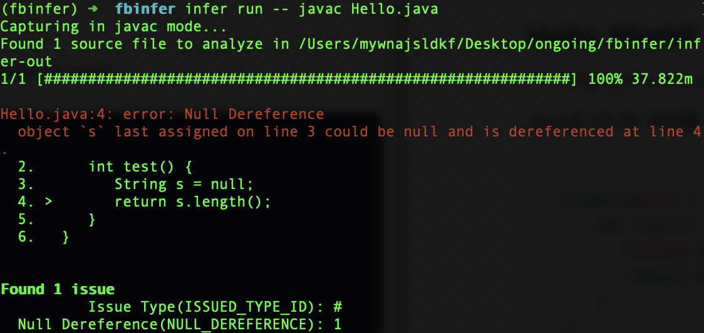
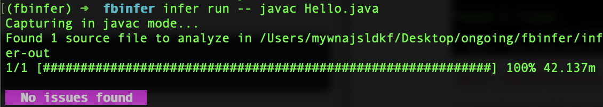

# Quick Start

Infer를 설치하고 간단한 예제를 통해 Infer를 사용해보겠습니다.

- 본 글은 Mac OS 환경을 기준으로 작성되었습니다.

## Getting started with Infer 

### Get Infer

Infer를 사용하기 위해서는 관련 라이브러리를 먼저 설치해야 합니다. Mac을 사용한다면 `brew` 를 통해 간편하게 FBInfer를 설치할 수 있습니다.

1. Dependency 설치하기

   FBInfer와 의존된 라이브러리를 미리 설치합니다. 필요한 라이브러리는 다음과 같습니다.

   - opam >= 2.0.0 (instructions [here](https://opam.ocaml.org/doc/Install.html#OSX))
   - sqlite
   - pkg-config
   - Java (only needed for the Java analysis)
   - CMake (only needed for the C/Objective-C analysis)
   - Ninja (optional, if you wish to use sequential linking when building the C/Objective-C analysis)
   - clang in Xcode command line tools. You can install them with the command `xcode-select --install` (only needed for the C/Objective-C analysis)
   - Xcode >= 6.1 (only needed for the C/Objective-C analysis)
   - autoconf >= 2.63 and automake >= 1.11.1 (if building from git)
   - gmp
   - mpfr

   Homebrew를 통해 간편하게 설치할 수 있다.

   ```shell
   brew install autoconf automake cmake opam pkg-config sqlite gmp mpfr java
   ```

​		

2. Homew로 Infer를 설치한다.

   ```shell
   brew install infer
   ```


**Reference**

- [FBInfer Dependency 설치](https://github.com/facebook/infer/blob/main/INSTALL.md)
- [Infer 설치](https://github.com/facebook/infer/blob/main/INSTALL.md)


## Hello, World!

FBInfer는 Java, Objective-C, C 언어로 작성되거나 Android, iOS, Make로 빌드되는 프로그램에서 사용할 수 있습니다.

- 본 글은 Java를 기준으로 작성되었습니다.

간단한 예제를 살펴보겠습니다. 

### Hello world Java

코드를 작성합니다.

```java
// Hello.java
class Hello {
   int test() {
      String s = null;
      return s.length();
   }
}
```

infer로 코드를 분석해보겠습니다.

- `infer --help` 를 사용하면 다양한 infer 명령어를 확인할 수 있습니다.

```shell
infer run -- javac Hello.java
```



빨간줄로 오류가 나온 것을 확인할 수 있습니다.

`Null Deference`는 널 객체를 잘못 사용했을 때 발생하는 에러입니다. 3번째 줄에서 객체 `s`를 null로 지정했는데 4번째 줄에서 존재하지 않는 객체인 null의 크기를 측정하기 때문입니다.

이 코드는 s가 null 객체인지 먼저 확인하고 null이 아니라면 실행하도록 수정해야 합니다.

```java
class Hello {
   int test() {
      String s = null;
      return s == null ? 0 : s.length();
   }
}
```

다시 한번 실행해보겠습니다.

아무런 오류가 발생하지 않은 것을 확인할 수 있습니다.



run 명령어를 실행하고 나면, 실행한 폴더에 `Hello.java`, `Hello.class`, `infer-out` 폴더가 생긴 것을 확인할 수 있습니다. 자세한 부분은 다음 장에서 살펴보겠습니다.